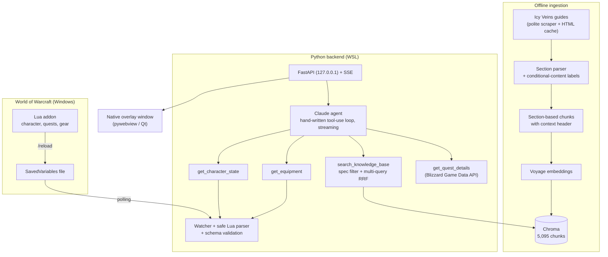

# Prestie

**An AI companion for World of Warcraft: a Claude-powered agent that reads your character in-game, searches 360 class guides, and answers in a native overlay window next to the game.**

> *"Is this ring in my bags an upgrade?"* — Prestie reads your gear exported by its in-game addon, looks up your spec's stat priority in the guides, computes the item-level difference, and answers in French with cited sources.

Prestie is a learning and portfolio project focused on **retrieval-augmented generation (RAG), tool-using agents and LLM evaluation**. The agent loop, context management and evaluation harness are written by hand (no LangChain / LlamaIndex) to understand each mechanism, and every change is backed by a measurement.

  

---

▶️ **[Watch the demo video]([docs/Prestie_Demo.mp4](https://github.com/user-attachments/assets/11c3a530-f465-4865-b868-66551e2add57))**: the overlay window next to the game, reading the character and answering a question with cited sources.

## What it does

- **Answers game questions from sources, not from memory.** Rotations, talents, stat priorities, gems and enchants come only from retrieved guide passages (Icy Veins, 40 specs, patch 12.1), with a sources section linking each article. When the guides don't cover something, the agent says so instead of guessing.
- **Knows your character without asking.** A Lua addon exports level, class, spec, hero talent, quests, worn gear and equippable bag items. The agent reads them through tools, so *"what should I upgrade first?"* just works.
- **Reasons over several sources.** Game state + guide passages + computed facts (item-level deltas per slot, empty slots, two-handed weapons) + official Blizzard quest data.
- **Remembers the conversation.** Follow-ups like *"and in Mythic+?"* work, while stale tool results are compacted so the agent re-reads a character that may have changed.
- **Streams into a native overlay.** A frameless, always-on-top, translucent window sits next to the game (FastAPI + Server-Sent Events + pywebview).

## Architecture



| Layer | Technology |
|---|---|
| LLM | Claude API: Opus for the agent, Sonnet as the evaluation judge (a different model, so the agent never grades itself) |
| Retrieval | Voyage `voyage-4-large` embeddings, Chroma vector store, metadata filtering, Reciprocal Rank Fusion |
| Game integration | Lua addon (SavedVariables), Blizzard Battle.net Game Data API (OAuth client credentials) |
| App | FastAPI, Server-Sent Events, vanilla HTML/JS (no build step), pywebview with the Qt backend |
| Quality | pytest (495 tests, TDD), Node test runner for the front-end, custom evaluation harness |

## Engineering highlights

**RAG pipeline**
- Polite scraping (robots.txt, delays, raw HTML cache) with per-chunk provenance (URL + anchor, authors, patch), so every answer can cite its sources and the content can be purged if needed.
- Chunking by logical section, with the page title and section path prefixed to each chunk. Content hidden behind JavaScript toggles becomes explicit labels (`[Levels 71-90]`, `[San'layn only]`) so the model knows who each piece of advice applies to.
- English corpus, French questions and answers: cross-lingual retrieval through multilingual embeddings, with no translation step.
- Spec filtering on every search. Without it, 37% of retrieved passages came from the wrong spec once all 40 specs were indexed.
- **Agent-written multi-query**: for vague or informal questions, the agent passes up to two alternative phrasings in one tool call, and the tool fuses the result lists with Reciprocal Rank Fusion. This adds no extra LLM call and no latency.

**Agent**
- A hand-written tool-use loop over the Claude Messages API, fully streamed (text deltas, tool-call events shown live in the UI), with server-side model fallbacks for refusals, including mid-stream.
- Prompt caching by design: the system prompt never changes. The character goes through a tool, not the prompt, so a level-up never invalidates the cache.
- **Context management**: before each question, earlier turns are compacted. Retrieved passages shrink to their section list, and stale character/gear snapshots become "read it again". Compaction is a pure, deterministic function, so already-compacted turns keep the same bytes and stay in the prompt cache.
- Tools do the arithmetic (item-level deltas, slot mapping) so the model spends its reasoning on what the guides say.

**Local app security** (the local API spends the user's API credits)
- Bound to `127.0.0.1` only; a custom header is required on POSTs (CSRF); a trusted-host check against DNS rebinding; a strict Content-Security-Policy; all model and game text is escaped before rendering.
- The game file is parsed by a custom Lua-table parser that never executes code.

## Evaluation

Every change was measured before being kept. The harness includes:

- **Retrieval eval**: 92 French player questions (16 deliberately *hard*: slang, French spell names, indirect wording), scored with hit@k, MRR and spec precision.
- **Relevance pooling with an LLM judge**: the top passages of *every* system being compared are judged, so the labels don't favour whichever system they were written against. Hand labels alone had made a re-ranker look worse than it was.
- **Agent eval**: four case sets (general Q&A, in-game character, multi-turn conversations, gear), 76 cases in total, each run twice with 95% confidence intervals. Each answer is graded by:
  - **deterministic checks**: did it search, cite only retrieved sources, read the character/gear when needed (and *not* when not needed), filter on the right spec;
  - **an LLM judge**: grounded, admits gaps, fits the player's spec and level, follows the conversation, answers in French.
- **Harness integrity**: the grading code is hashed and a run refuses to start if it changed without explicit approval, since scores graded by different code aren't comparable. Infrastructure failures (API errors, judge errors, unexpected served model) are recorded separately, never counted as model failures.

### Selected results

| Experiment | Result |
|---|---|
| Query rewriting (MRR on hard / normal questions) | raw question 0.70 / 0.92 → single rewrite 0.94 / 0.96 → **multi-query 0.97 / 0.97**; HyDE rejected (0.93 / **0.90**, it hurt clear questions) |
| Conversation memory (multi-turn eval) | re-reading the character after an in-game `/reload`: **0.50 → 1.00** thanks to context compaction; a failure the LLM judge had missed, caught by a deterministic check |
| Gear advice (gear eval) | pass 0.68 → **0.77**, with **every substance criterion at 1.00** after ingesting the gems/enchants guides and fixing how the tool presented its data |
| Re-ranking (Voyage rerank) | measured but **not shipped**: with spec filtering, the top-5 already contained the answer; re-ranking only reordered it, for +340 ms per search |

### What didn't go as planned (and what fixed it)

- **The eval itself was biased.** Narrow hand labels penalized systems that found *other* valid passages. Fixed with relevance pooling.
- **The eval saturated.** With hit@5 at 1.00, no retrieval improvement could show up. Fixed with a set of hard, realistic questions.
- **The model filled gaps from memory.** It recommended leveling-only enchants and claimed cloaks can be enchanted, which is wrong in the current patch. Fixed by ingesting the missing guide pages instead of relaxing the grounding rule.
- **The tool's formatting misled the model.** "Not enchanted" printed on slots that can't be enchanted, and "off hand empty" next to a two-handed staff, led to invented advice. Fixed at the tool level.
- **Platform constraints.** WoW addons can only write to disk on `/reload`, so there is no in-game chat and the exported state carries its age. WebView2 can't do per-pixel transparency, so the window switched to the Qt backend after measuring both with a prototype.

## Project structure

```
addon/Prestie/           Lua addon: character, quests and gear export
src/prestie/
  ingestion/             polite scraper, HTML parser, chunking
  knowledge/             embeddings, Chroma store, retriever, rank fusion, query rewriting
  character/             safe Lua parser, validated character state and equipment, file watcher
  blizzard/              OAuth client, quest data and cache
  agent/                 agent loop, context compaction, prompts, tools
  api/                   FastAPI + SSE, static front-end
  evaluation/            retrieval eval, relevance judge, agent eval harness
desktop/                 native window launcher (pywebview)
prototypes/              throwaway probes that measured platform constraints
tests/                   pytest suite (+ Node tests for the front-end)
```

## Getting started

Requirements: Python 3.13, [uv](https://docs.astral.sh/uv/), and API keys for Anthropic, Voyage AI and (for quests) the Blizzard developer portal. The in-game features need World of Warcraft with the addon installed.

```bash
git clone https://github.com/Arslane18/prestie.git
cd prestie
uv sync
cp .env.example .env        # then fill in the keys
```

Build the knowledge base (downloads the guides once, politely, then indexes them):

```bash
uv run prestie scrape
uv run prestie ingest
```

Ask questions:

```bash
uv run prestie chat --level 90 --hero-talent "San'layn"   # CLI, without the game
uv run prestie serve --open                               # overlay window, reading the addon export
```

For the in-game mode, copy `addon/Prestie/` into `World of Warcraft/_retail_/Interface/AddOns/`, set `PRESTIE_SAVEDVARIABLES` in `.env`, and type `/prestie sync` in game to refresh the export.

Other commands:

```bash
uv run prestie search "when to use Vampiric Blood"        # retrieval only
uv run prestie eval --spec-filter [--rewrite multi]       # retrieval evaluation
uv run prestie eval-agent --cases … --flow-dir … --variant v1   # agent evaluation
uv run pytest                                             # test suite
```

## Data and licensing

Guide content comes from [Icy Veins](https://www.icy-veins.com/), whose terms allow reuse **for non-commercial purposes with visible attribution**. Every answer lists its source articles with links, and the scraped content is never redistributed in this repository. Quest data comes from the official Blizzard Game Data API. World of Warcraft is a trademark of Blizzard Entertainment; this project is not affiliated with Blizzard or Icy Veins.

Code: [MIT](LICENSE).

## Roadmap

- **Observability**: trace real sessions (tools called, queries, passages read, latency, cost) and turn real player questions into eval cases.
- **Corpus freshness**: detect new game patches and re-ingest only the pages that changed.
- **Long-conversation cost**: measure 10–15-question sessions with realistic pauses (prompt-cache TTL of 5 minutes vs 1 hour).
- **Native Windows packaging**, if the project ever targets other players.
